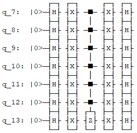
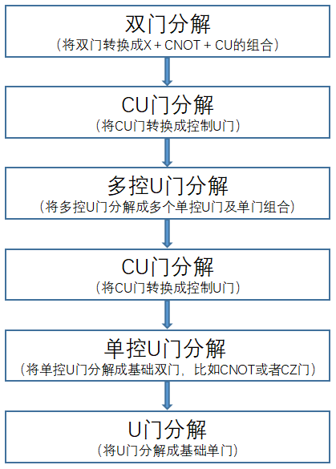

多控门分解
=====================
    在量子算法实现过程中，经常会用到多控门，如下图所示：

    量子程序员在设计量子算法时经常会用到多控门，如上图所示，从图中我们可以看到有一个6个qubit受控的CZ门，在更加复杂的量子算法场景下，将会出现更多的、受控维度更高的多控门。目前实现的物理量子计算机基本都不支持多控门，并且我们无法保证所有的受控物理qubit都处于连通状态（目前的物理量子芯片都有固定的拓扑结构），所以想要在真实物理量子计算机上运行量子算法，首先要对多控门进行拆解，使其转换成N个量子芯片支持的逻辑门的组合，以适配目标量子芯片。
    目前QPanda中实现了两种多控门分解算法，并封装成对应的算法接口，下面分别对两种分解方法做详细介绍。
    
算法概述及接口介绍
>>>>>>>>>>
----

1. 普通的多控门分解算法
该算法的实现过程如下流程图所示：

对应的接口如下：

.. code-block:: c

    /**
     * @brief Decompose multiple control QGate
     * @ingroup Utilities
     * @param[in] QProg& Quantum Program
     * @param[in] QuantumMachine* quantum machine pointer
     * @param[in] const std::string& It can be configuration file or configuration data, which can be distinguished by file suffix, so the configuration file must be end with ".json", default is CONFIG_PATH
     * @return
     */
    void decompose_multiple_control_qgate(QProg& prog,  QuantumMachine *quantum_machine, const std::string& config_data = CONFIG_PATH);
    void decompose_multiple_control_qgate( QCircuit& cir, QuantumMachine *quantum_machine, const std::string& config_data = CONFIG_PATH);
    
使用介绍
>>>>>>>>>>>>>>>>
----

    通过调用decompose_multiple_control_qgate接口，可将目标量子线路中的多控门转换为指定的基础逻辑门组合，其中基础逻辑门包括基础单门和基础单门，通过配置文件给出。该接口需要3个参数，
第一个是目标量子线路或者量子程序，第二个是目标量子线路或者量子程序对应的量子虚拟机，第三个参数用于指定配置信息，配置信息可以json文件或者json字符串，配置文件中指定了基础逻辑门信息。

实例
>>>>>>>>>>
----

.. _酉矩阵分解示例程序:
以下示例展示了部分振幅量子虚拟机接口的使用方式

.. code-block:: c
  
    #include "QPanda.h"
    USING_QPANDA

        int main()
        {
            auto qvm = new CPUQVM();
            qvm->init();
            auto q = qvm->qAllocMany(2);

            QStat source_matrix =
            {
                qcomplex_t(0.6477054522122977, 0.1195417767870219),qcomplex_t(-0.16162176706189357, -0.4020495632468249),qcomplex_t(-0.19991615329121998, -0.3764618308248643),qcomplex_t(-0.2599957197928922, -0.35935248873007863),
                qcomplex_t(-0.16162176706189363, -0.40204956324682495),qcomplex_t(0.7303014482204584, -0.4215172444390785),qcomplex_t(-0.15199187936216693, 0.09733585496768032),qcomplex_t(-0.22248203136345918, -0.1383600597660744),
                qcomplex_t(-0.19991615329122003 , -0.3764618308248644),qcomplex_t(-0.15199187936216688, 0.09733585496768032),qcomplex_t(0.6826630277354306, -0.37517063774206166),qcomplex_t(-0.3078966462928956, -0.2900897445133085),
                qcomplex_t(-0.2599957197928923, -0.3593524887300787),qcomplex_t(-0.22248203136345912, -0.1383600597660744),qcomplex_t(-0.30789664629289554, -0.2900897445133085),qcomplex_t(0.6640994547408099, -0.338593803336005)
            };

            std::cout << "source matrix:" << std::endl << source_matrix << std::endl;

        QCircuit out_cir = matrix_decompose_qr(q, source_matrix);
        auto circuit_matrix = getCircuitMatrix(out_cir);

            std::cout << "the decomposed matrix:" << std::endl << circuit_matrix << std::endl;

            if (!mat_compare(source_matrix, circuit_matrix, 0.000001))
            {
                std::cout << "matrix decompose ok !" << std::endl;
            }
            return 0;
        }
        return 0;
    }

上述实例运行的结果如下：

    .. code-block:: c

      source matrix:

      (0.647705452212298, 0.119541776787022)  (-0.161621767061894, -0.402049563246825)   (-0.19991615329122, -0.376461830824864)  (-0.259995719792892, -0.359352488730079)
      (-0.161621767061894, -0.402049563246825)   (0.730301448220458, -0.421517244439079)  (-0.151991879362167, 0.0973358549676803)  (-0.222482031363459, -0.138360059766074)
      (-0.19991615329122, -0.376461830824864)  (-0.151991879362167, 0.0973358549676803)   (0.682663027735431, -0.375170637742062)  (-0.307896646292896, -0.290089744513308)
      (-0.259995719792892, -0.359352488730079)  (-0.222482031363459, -0.138360059766074)  (-0.307896646292896, -0.290089744513308)    (0.66409945474081, -0.338593803336005)

      the decomposed matrix:

      (0.647705452212298, 0.119541776787022)  (-0.161621767061894, -0.402049563246825)   (-0.19991615329122, -0.376461830824865)  (-0.259995719792892, -0.359352488730079)
      (-0.161621767061894, -0.402049563246825)   (0.730301448220459, -0.421517244439079)  (-0.151991879362167, 0.0973358549676799)  (-0.222482031363459, -0.138360059766075)
      (-0.19991615329122, -0.376461830824865)  (-0.151991879362167, 0.0973358549676804)   (0.682663027735431, -0.375170637742062)  (-0.307896646292896, -0.290089744513309)
      (-0.259995719792892, -0.359352488730079)  (-0.222482031363459, -0.138360059766074)  (-0.307896646292896, -0.290089744513308)    (0.66409945474081, -0.338593803336005)

matrix decompose ok !

2. ldd多控门分解算法

